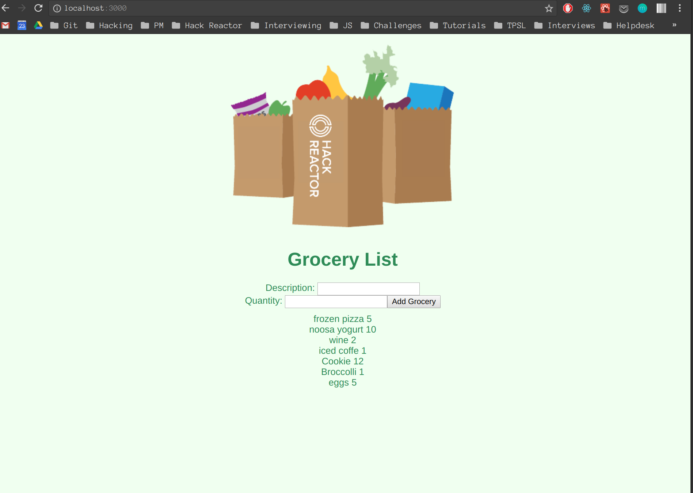

## HACK REACTOR REVIEW - GROCERY LIST

# The App
 

# Description
Grocery List displays a list of groceries and their quantity from the database upon initial load.
It allos users to add more groceries to the database and immediately displays new ones added.

# The Plan
0. Explanation of wireframe/app
1. Architecture diagram activity
2. Front end implementation
3. Server Implementation
4. Databse Implementation
6. Connect db and server
7. Connect server and front end

